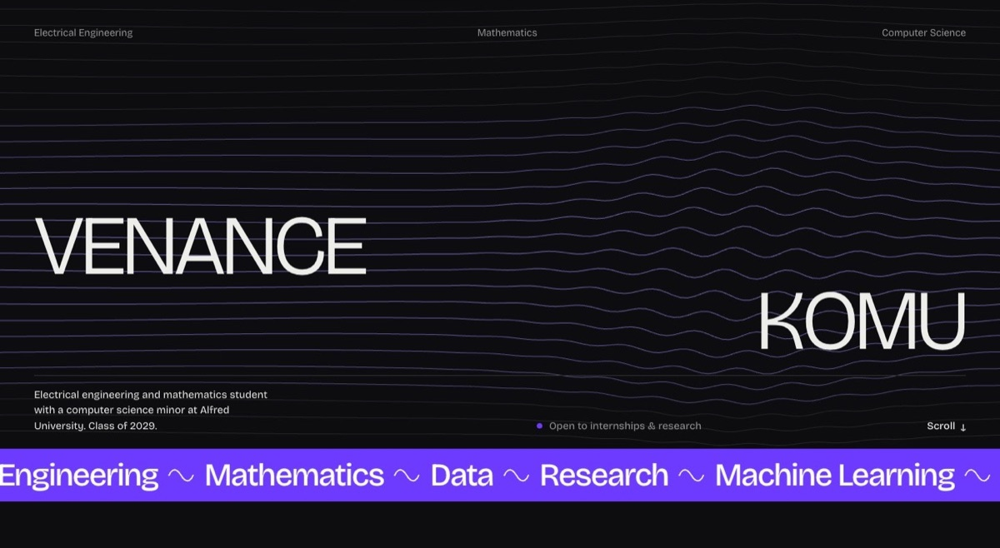

  

  
  
  
  

I study electrical engineering and mathematics at Alfred University, with a minor in computer science, and expect to graduate in May 2029. Most of my work sits where hardware meets data. This summer I modeled how much gallium, a critical semiconductor material, could be recovered from secondary sources for the U.S. supply chain, and trained a computer-vision model that finds the components on a circuit board and estimates the critical materials inside them. Before Alfred, I cleaned up property and tenant records for the National Housing Corporation in Tanzania.

**Now:** evaluating battery storage for an off-grid tiny house, and treasurer of ColorStack and the Robotics Club at Alfred. 
**Looking for:** internships and undergraduate research positions.

## Projects

<table>
  <tr>
    <td width="50%" valign="top">
      
    </td>
    <td width="50%" valign="top">
      <h3>Critical Materials Circuit Component Detector</h3>
      PERSONAL PROJECT · SUMMER 2026
      
Computer vision for critical materials. I trained a YOLOv8 model in PyTorch to detect five component classes (ICs, capacitors, resistors, transistors and connectors) on about 500 circuit-board images with 2,000+ labeled instances, split 70/15/15. The detections are then matched to a critical-materials reference database to estimate each board's material content in mg or g, with the assumptions behind each estimate stated.

      
Python · PyTorch · YOLOv8 · OpenCV · NumPy/pandas · Linux

    </td>
  </tr>
  <tr>
    <td width="50%" valign="top">
      
      <h3>Gallium Recovery Study</h3>
      RESEARCH · INAMORI SCHOOL OF ENGINEERING · MAY – JUL 2026
      
A Material Flow Analysis (MFA) of gallium across secondary sources, using Monte Carlo simulation to quantify the uncertainty in how much could be recovered for the U.S. supply chain. I also analyzed X-ray fluorescence (XRF) measurements in Python to compare gallium concentrations across candidate materials.

      
Python · pandas · NumPy · Matplotlib · Excel · Git

      <a href="https://github.com/venancekomu03-hub/Gallium_Secondary_Sources_Analysis">Repository →</a>
    </td>
    <td width="50%" valign="top">
      
      <h3>Food Cargo Tracking System</h3>
      WFP TANZANIA · AUG 2024 – JAN 2025
      
Prototype of a collaborative tracking platform for food cargo across 10+ delivery points in Tanzania, supporting UN SDG 2 (Zero Hunger). A real-time dashboard with geofencing, GPS tracking and AI-powered metrics, projected to cut communication inefficiencies and emergency calls by 80%.

      
Human-centered design · Figma

    </td>
  </tr>
  <tr>
    <td width="50%" valign="top">
      
      <h3>Tiny House Project</h3>
      ENGINEERING · SEP 2025 – NOW
      
Evaluating and optimizing battery energy-storage configurations for an off-grid tiny house, comparing capacity, efficiency, load requirements and cost estimates to support reliable power delivery.

      
Python · Excel

    </td>
    <td width="50%" valign="top">
      
      <h3>Machine Learning with Python</h3>
      FREECODECAMP · FALL 2026
      
TensorFlow/Keras models for image classification (a CNN), SMS spam detection (NLP) and healthcare cost prediction (regression), a K-Nearest Neighbors book recommender built with scikit-learn on a 1.1M-rating dataset, and an algorithm that plays Rock Paper Scissors.

      
Python · TensorFlow/Keras · scikit-learn · NumPy · pandas

    </td>
  </tr>
  <tr>
    <td width="50%" valign="top">
      <h3>This Website</h3>
      WEB · 2026 – NOW
      
My portfolio, written in plain HTML, CSS and JavaScript with no framework or build step. Signal lines drawn on a canvas bend around the cursor, each project gets generated SVG artwork, and every animation turns off for visitors who prefer reduced motion. Hosted on GitHub Pages.

      
HTML · CSS · JavaScript · Canvas · SVG

      <a href="https://venancekomu03-hub.github.io">Visit →</a> · <a href="https://github.com/venancekomu03-hub/venancekomu03-hub.github.io">Source →</a>
    </td>
    <td width="50%" valign="top">
      
    </td>
  </tr>
</table>

## Experience

**Undergraduate Researcher** · Inamori School of Engineering, Alfred University · *May – Jul 2026*
- Built a Material Flow Analysis model of gallium across secondary sources, using Monte Carlo simulation to quantify uncertainty in recovery for the U.S. supply chain.
- Analyzed X-ray fluorescence measurements with Python scripts and Matplotlib plots to compare gallium concentrations across potential recovery sources, versioning the analysis code in Git/GitHub.
- Compiled and cleaned data on secondary gallium sources in Python (pandas, NumPy) and Excel, applying descriptive statistics to compare materials.

**Intern** · National Housing Corporation, Moshi, Tanzania · *Sep 2024 – Jan 2025*
- Restructured and standardized property and tenant datasets in Excel and SQL, improving data accuracy and record retrieval.
- Analyzed property tax, payment and maintenance records to find discrepancies, modeled trends and forecast from past records, and presented the findings in PowerPoint to support management decisions.

**Technical Interview Prep** · CodePath, remote · *Spring 2026*
- Intensive training in data structures, algorithms and problem-solving in Python: recursion, sorting, searching, hash tables and linked data structures.

**Machine Learning & Scientific Computing with Python** · freeCodeCamp, remote · *Fall 2026*
- The five machine learning projects above, plus object-oriented Python programs for scientific computing.

**Treasurer** · ColorStack, Alfred University chapter · *Aug 2026 – now*
- Build semester budgets for workshops, mentorship and career events, track expenses in Excel, and prepare funding requests.

**Treasurer** · Robotics Club, Alfred University · *Sep 2025 – now*
- Allocate the club's budget across robotics projects and activities, and maintain its financial records in Excel.

## Education

**Alfred University** · Alfred, NY · *Expected May 2029* 
B.S. Electrical Engineering and Mathematics, double major · Computer Science minor 
Dean's List 2025 and 2026 · SAT Math 790/800

**Coursework** · Circuit Theory · Digital Logic · Computer Organization & Architecture · Data Structures & Algorithms · Object-Oriented Programming · Software Development Lifecycle · System Design · Discrete Mathematics · Linear Algebra · Multivariable Calculus · Differential Equations · Probability & Statistics

## Toolkit

  

**Languages** · Python, C, C++, Java, MATLAB, VHDL, SQL, JavaScript, HTML/CSS 
**ML & data** · PyTorch, YOLOv8 (Ultralytics), OpenCV, TensorFlow/Keras, scikit-learn, NumPy, pandas, Matplotlib 
**Engineering & design** · LTspice, SolidWorks, Figma 
**Methods** · Material Flow Analysis, Monte Carlo simulation, descriptive statistics, forecasting 
**Web** · React, AngularJS, Bootstrap, FastAPI, Chart.js, REST APIs 
**Data stores & cloud** · PostgreSQL, MongoDB, Azure 
**Tools & OS** · Git, GitHub, Linux (Ubuntu), macOS, Windows, Visual Studio, GitHub Copilot CLI, Claude Code, Excel, Word, PowerPoint

 

The violet is gallium's 417 nm spectral line.
